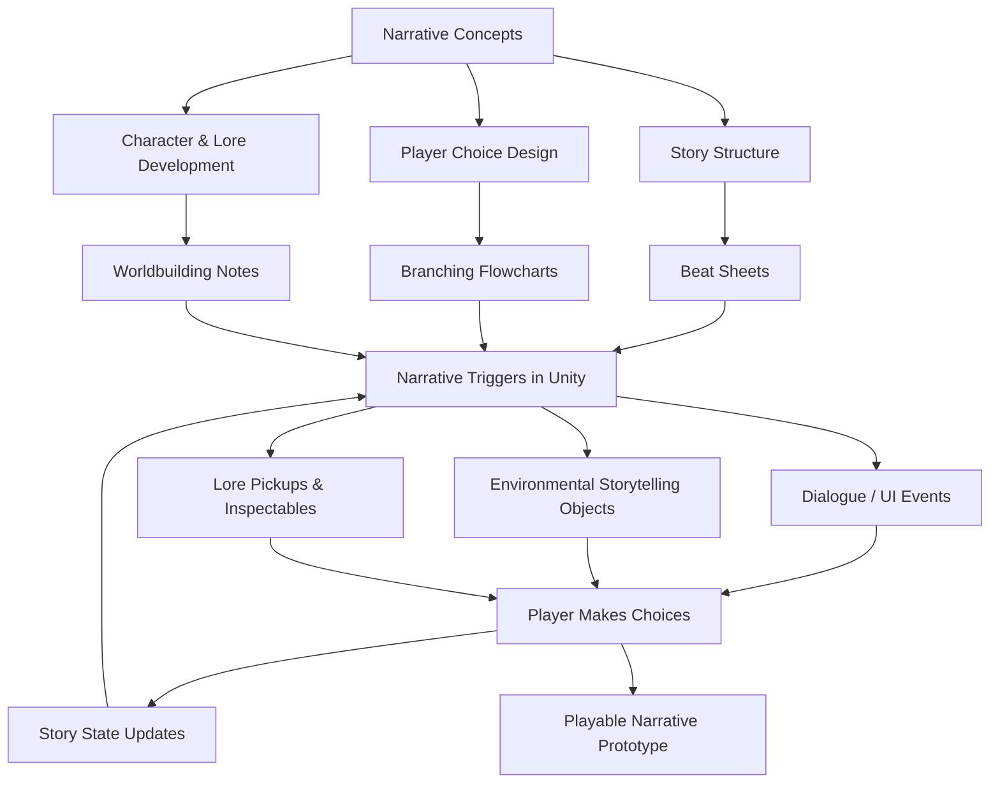

# GDD525 - Narrative Design & Interactive Fiction
## **1. Module Overview**

### **1.1 What This Module Is About**

This module introduces students to the principles and practices of **narrative design for interactive media**, with a focus on building **story-driven gameplay experiences** such as visual novels, exploration games, choice-based fiction, and branching narratives.

Because the cohort includes both **Game Development** students (comfortable in engines) and **Creative Writing** students (little or no technical experience), all practical work is designed to be **accessible, scaffolded, and engine-minimal**. Students will work with a **pre-built 3D whitebox environment**, a **third-person controller**, and **ready-made narrative trigger systems**, so they can focus on **story structure, pacing, choice design, environmental storytelling, and player agency** rather than complex code or systems building.

The goal of the module is not to teach advanced programming or full game production pipelines.
Instead, the goal is to give students the tools and understanding needed to **craft compelling interactive stories** and **deliver them through clear, functional gameplay experiences**.

---

### **1.2 Aims for Learners**

By the end of the module, students should be able to:

* Apply narrative design principles to create engaging interactive stories.
* Structure branching and non-linear narratives that support player choice.
* Understand the tension between **authored narrative flow** and **player-driven exploration**, and design for both.
* Use a provided Unity project (character controller, camera, triggers, UI) to implement interactive narrative sequences.
* Build scene-based storytelling elements such as **lore pickups**, **environmental storytelling**, **dialogue/UI cutscenes**, and **sequence triggers**.
* Write and organise dialogue, lore, and narrative events in a format suitable for integration into a game engine.
* Create a short playable narrative prototype demonstrating their design intentions.

---

### **1.3 Skills We Will Cover**

#### **Narrative Design Skills**

* Writing for branching and non-linear structures
* Designing meaningful player choices
* Managing pacing and information delivery
* Environmental storytelling (props, spaces, environmental cues)
* Diegetic and non-diegetic narration
* Creating story bibles, beat sheets, and interactive flowcharts

#### **Interactive Storytelling Skills**

* Designing and sequencing narrative triggers
* Building dialogue moments, lore interactions, and cutscene-style sequences
* Structuring level flow for both guided and open exploration
* Handling consequences and narrative state

#### **Practical Unity Skills (Minimal & Accessible)**

* Working with a pre-built 3rd-person controller & follow camera
* Using trigger volumes for narrative events
* Displaying text-based interactions (dialogue boxes, letters, monologues)
* Adding simple interactivity (pickups, inspect moments, unlocks, branching dialogue)
* Editing simple scriptable assets to structure dialogue or event chains
* Using timeline-style or sequence-based storytelling tools where appropriate

#### **Collaboration & Production Skills**

* Iterating narrative content based on feedback
* Communicating story intent through clear documentation
* Integrating writing and gameplay meaningfully

---

### **1.4 Narrative Systems – Module Touchstone Map**

How the major parts of narrative design and simple interactive systems connect together in this module.

---

### **1.5 What We Are *Not* Covering**

We intentionally avoid **advanced game development, code-heavy interaction systems, or cinematic-level production tools**, as these require prior engine experience and fall outside the module’s focus. The intent is to keep the technology **simple, predictable, and accessible**, allowing students to concentrate on **storycraft, player agency, and narrative design thinking** rather than engine complexity.

Students may see references to more advanced tools or workflows, but these will not be required for assessment and are kept outside scope to ensure a fair learning experience for mixed-background cohorts.

---

### **1.6 Practical Projects in the Semester**

Students will complete **one core narrative prototype**, developed in stages across the semester, supported by weekly exercises:

#### **1) Interactive Narrative Prototype (Weeks 1–12)**

A short playable experience built in Unity using the provided project template. Must include:

* A clear narrative arc or branching structure
* At least three narrative trigger moments (dialogue, monologue, event, or reveal)
* One or more lore interactions (letters, notes, inspectables, environmental clues)
* A designed flow that balances **directed sequences** (authored order) and **player-driven exploration**
* Documentation that outlines their story structure, intended choices, and narrative logic

This project demonstrates practical understanding of **interactive storytelling**, **player agency**, and **story delivery tools**.

---
